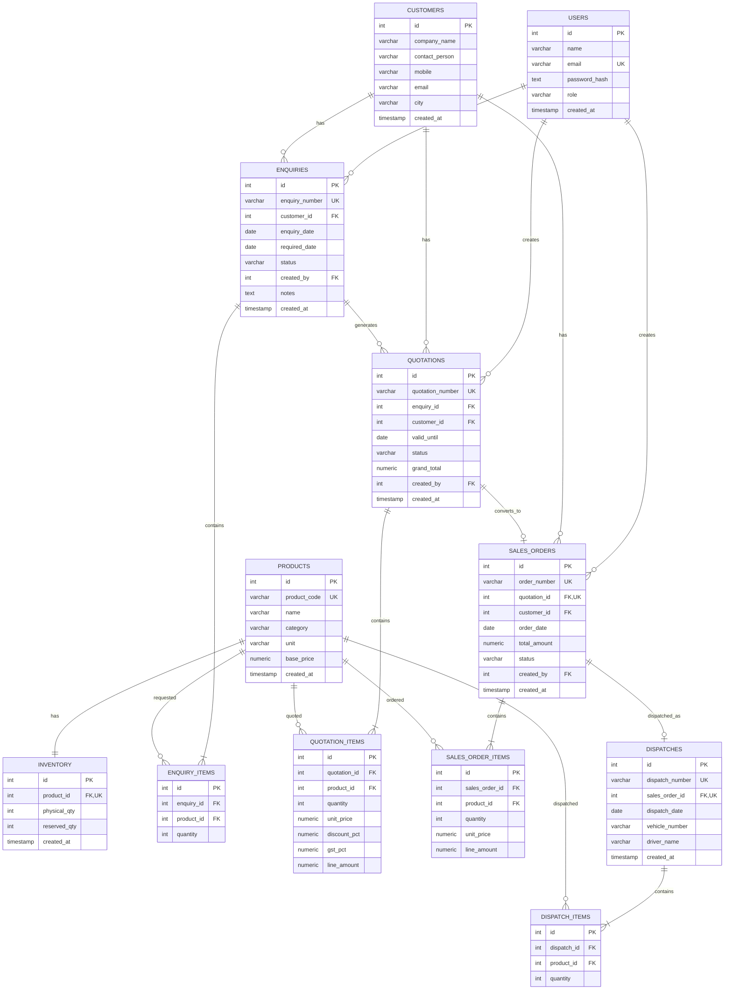

# ERPFlow ER Diagram

The ERPFlow database is a relational PostgreSQL schema designed around the complete business workflow:

**Customer Enquiry → Quotation → Sales Order → Inventory Reservation → Dispatch**

## ER Diagram



---

# Relationship Explanation

## Users → Enquiries

One user can create many enquiries.

```text
users.id
    ↓
enquiries.created_by
```

---

## Users → Quotations

One user can create many quotations.

```text
users.id
    ↓
quotations.created_by
```

---

## Users → Sales Orders

One user can create many sales orders.

```text
users.id
    ↓
sales_orders.created_by
```

---

## Customers → Enquiries

A customer can have multiple enquiries.

```text
customers.id
    ↓
enquiries.customer_id
```

---

## Enquiries → Enquiry Items

One enquiry contains multiple products.

```text
enquiries.id
    ↓
enquiry_items.enquiry_id
```

The `enquiry_items` table resolves the many-to-many relationship between enquiries and products.

---

## Products → Inventory

Each product has one inventory record.

```text
products.id
    ↓
inventory.product_id
```

The database enforces this using:

```sql
UNIQUE(product_id)
```

---

## Enquiries → Quotations

An enquiry can be associated with quotations.

The application workflow creates a quotation from an enquiry and moves the enquiry from:

```text
NEW → QUOTED
```

---

## Quotations → Quotation Items

A quotation contains multiple products.

```text
quotations.id
    ↓
quotation_items.quotation_id
```

Each quotation item stores the commercial values required at quotation time:

- Quantity
- Unit price
- Discount
- GST
- Final line amount

This preserves the quoted price even if the product's current base price changes later.

---

## Quotations → Sales Orders

An accepted quotation can be converted into one sales order.

The database enforces:

```sql
UNIQUE(quotation_id)
```

Therefore:

```text
1 quotation → maximum 1 sales order
```

This provides an additional database-level safeguard against duplicate order creation.

---

## Sales Orders → Sales Order Items

A sales order contains one or more products.

```text
sales_orders.id
    ↓
sales_order_items.sales_order_id
```

---

## Sales Orders → Dispatches

The current implementation performs a complete one-shot dispatch.

The database enforces:

```sql
UNIQUE(sales_order_id)
```

Therefore:

```text
1 sales order → maximum 1 dispatch
```

---

## Dispatches → Dispatch Items

A dispatch contains the products and quantities being dispatched.

```text
dispatches.id
    ↓
dispatch_items.dispatch_id
```

---

# Inventory Model

Inventory tracks two important quantities:

```text
Physical Quantity
Reserved Quantity
```

Available quantity is derived:

```text
Available = Physical − Reserved
```

### Example

```text
Physical = 100
Reserved = 30

Available = 100 - 30
          = 70
```

When a Sales Order is confirmed:

```text
Physical = unchanged
Reserved = Reserved + Order Quantity
```

When the order is dispatched:

```text
Physical = Physical - Dispatch Quantity
Reserved = Reserved - Dispatch Quantity
```

---

# Transaction Boundaries

The most important transaction boundaries are:

### Sales Order Confirmation

```text
BEGIN
 ↓
Lock Sales Order
 ↓
Lock Inventory Rows
 ↓
Check Available Stock
 ↓
Increase Reserved Quantity
 ↓
Set Order = CONFIRMED
 ↓
COMMIT
```

If any inventory check fails:

```text
ROLLBACK
```

### Dispatch

```text
BEGIN
 ↓
Lock Sales Order
 ↓
Validate CONFIRMED status
 ↓
Create Dispatch
 ↓
Lock Inventory Rows
 ↓
Decrease Physical Quantity
 ↓
Decrease Reserved Quantity
 ↓
Create Dispatch Items
 ↓
Set Order = DISPATCHED
 ↓
COMMIT
```

If any operation fails:

```text
ROLLBACK
```

---

# Key Database Constraints

The schema uses PostgreSQL constraints to protect data integrity.

### Primary Keys

Every table has an `id` primary key.

### Foreign Keys

Relationships are enforced using foreign keys.

### Unique Constraints

Examples:

```text
users.email
products.product_code
enquiries.enquiry_number
quotations.quotation_number
sales_orders.order_number
sales_orders.quotation_id
dispatches.dispatch_number
dispatches.sales_order_id
```

### Check Constraints

Examples:

```text
quantity > 0
physical_qty >= 0
reserved_qty >= 0
discount_pct between 0 and 100
gst_pct between 0 and 100
```

These constraints provide database-level protection in addition to backend validation.
